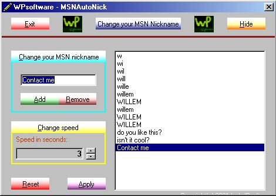

<div align="center">

## Make your MSN nickname more lively, let it change every 2 seconds


</div>

### Description

Here is a great program to make your MSNmessenger nickname more lively. Just make a list of your nicknames (eg. Willem, wIllem, wiLlem, wilLem, willEm, willeM) and let this program change your nick every period of time you specified. You can set a speed between 1 and 60 seconds.
 
### More Info
 
Make a simple list with an add and delete button

Your nicknames will be displayed in your, and the ones of your friends MSN messenger


<span>             |<span>
---                |---
**Submitted On**   |2001-08-30 13:04:22
**By**             |[Willem Pardaens](https://github.com/Planet-Source-Code/PSCIndex/blob/master/ByAuthor/willem-pardaens.md)
**Level**          |Intermediate
**User Rating**    |4.8 (38 globes from 8 users)
**Compatibility**  |VB 6\.0
**Category**       |[Miscellaneous](https://github.com/Planet-Source-Code/PSCIndex/blob/master/ByCategory/miscellaneous__1-1.md)
**World**          |[Visual Basic](https://github.com/Planet-Source-Code/PSCIndex/blob/master/ByWorld/visual-basic.md)
**Archive File**   |[Make your 255958302001\.zip](https://github.com/Planet-Source-Code/willem-pardaens-make-your-msn-nickname-more-lively-let-it-change-every-2-seconds__1-26800/archive/master.zip)

### API Declarations

```
FindWindow API
SetWindowText API
```


